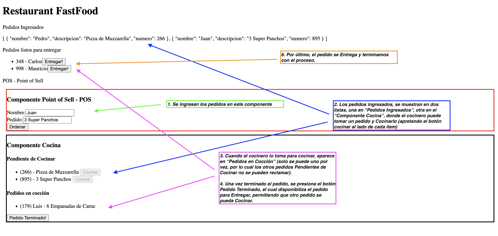

# Challenge Clase 3 - FastFood

## Descripción

La idea es hacer una App que nos permita gestionar un restaurant de comida rápida:
- Ingresar un nuevo pedido
- Mostrarlo como "pendiente"
- Poder tomarlo en cocina para cocinar
- Una vez terminado notificar que se encuentra listo para entregar
- Entregarlo

La aplicación constará de 4 Componentes
- POS: Point of Sell (Donde se hacen los pedidos)
- Cocina: Lugar donde se toman y cocinan los pedidos
- Punto de Entrega: Donde entegamos el pedido
- Restaurante: La aplicación que engloba los componentes

En este ejercicio podrán hacer uso de Input, Output, ngIf, ngFor, comunicación entre componentes padres e hijos.

## Puntos Técnicos

Clase Pedido:
```
{
    numero: number; // Numero de pedido random de 1 a 1000
    nombre: string;  // Nombre del cliente
    descripcion: string;  // Descripción del pedido
}
```

Importante recordar la separación de responsabilidades, quien hace que y como.


## Ejemplo:


